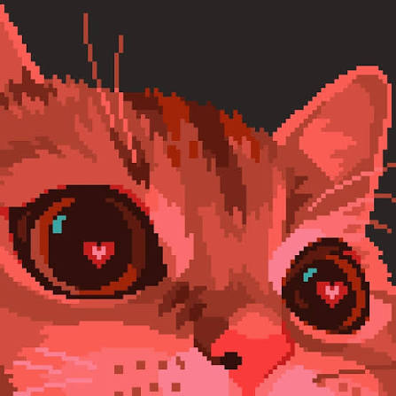
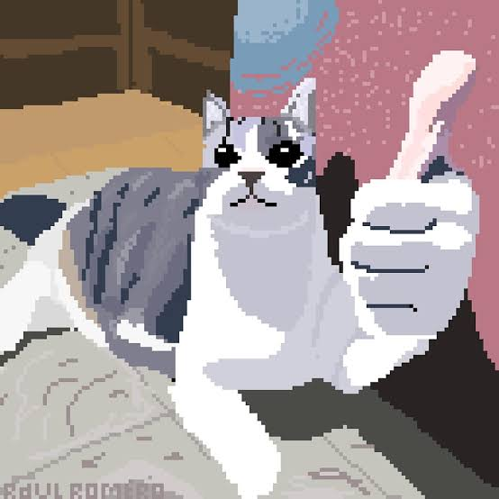
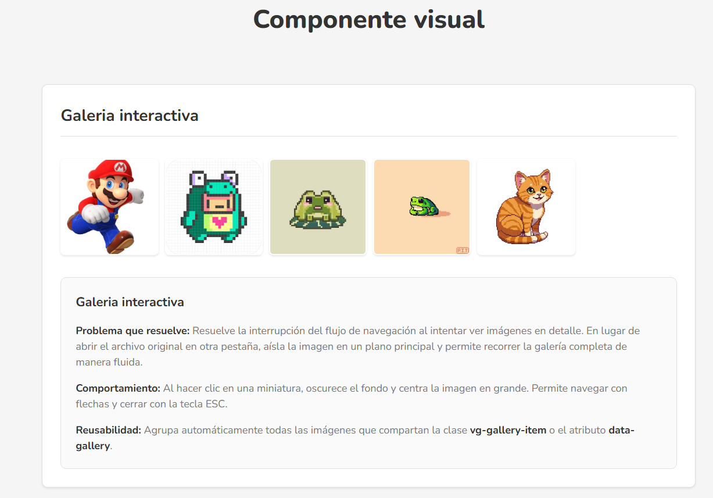
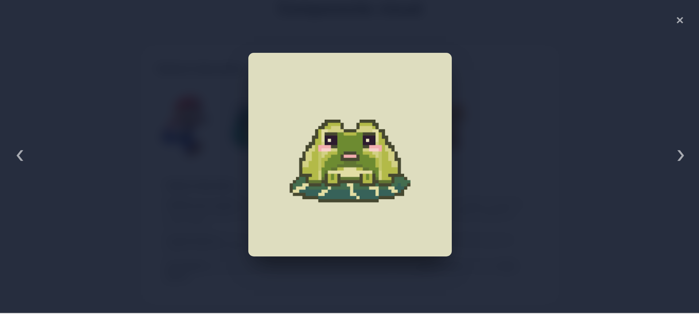
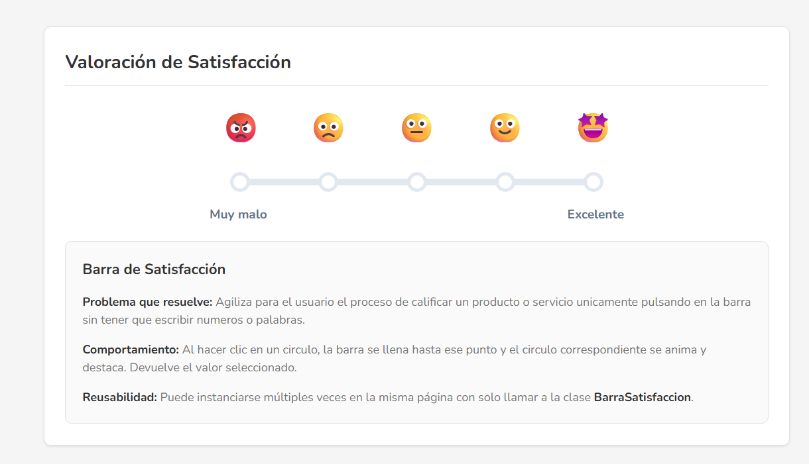
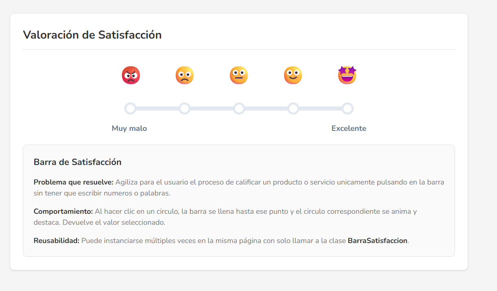

# Componente Visual

**Nombre:** Alejandro Jimenez Victoria
**Numero de control:** 23160968


Este proyecto incluye dos componentes visuales interactivos y reutilizables construidos con Vanilla JS y CSS puro, diseñados con una estética moderna, clara y cálida. No requieren dependencias externas.

1. **Galería Expandible**
2. **Barra de Satisfacción**

---

## Problemas que resuelven

### 1. Galería Expandible
En el desarrollo web, abrir una imagen en su tamaño original en una pestaña nueva o salir de la página interrumpe el flujo de navegación. La **Galería Expandible** resuelve esto aislando la imagen en un modal inmersivo interactivo, sin salir de la vista actual.

### 2. Barra de Satisfacción
Recoger feedback del usuario con formularios aburridos reduce la tasa de respuesta. La **Barra de Satisfacción** resuelve esto ofreciendo un componente visual rápido, amigable e interactivo, donde con un solo clic en una escala gráfica el usuario comunica su nivel de satisfacción visualmente.

## Instalación

Para hacer uso de estos componentes en tu proyecto debes enlazar los archivos CSS y JS en tu documento HTML:

```html
<!-- En tu <head> -->
<link rel="stylesheet" href="css/componente.css">

<!-- Antes del cierre de tu </body> -->
<script src="js/componente.js"></script>
```

## Estructura del Proyecto

```text
/componente-visual
├── README.md
├── index.html
├── css/
│   ├── componente.css
│   └── demo.css
├── js/
│   └── componente.js
└── img/
```

---

## Uso y Documentación

### 1. Galería Expandible
Para utilizar la galería, agrega tus imágenes y asígnales la clase `vg-gallery-item`. Opcionalmente usa `data-highres` para resolución completa.

**HTML:**
```html
<div class="mi-galeria">
    
    
</div>
```

**JavaScript:**
```javascript
document.addEventListener('DOMContentLoaded', () => {
    const galeria = new GaleriaExpandible({ selector: '.vg-gallery-item' });
});
```

### 2. Barra de Satisfacción
Inserta la estructura HTML base y crea una instancia de la clase pasando su ID o selector.

**HTML:**
```html
<div class="vg-satisfaction-bar" id="mi-barra">
    <div class="vg-sb-emojis">
        <div class="vg-sb-emoji" data-value="1">😡</div>
        <div class="vg-sb-emoji" data-value="2">🙁</div>
        <div class="vg-sb-emoji" data-value="3">😐</div>
        <div class="vg-sb-emoji" data-value="4">🙂</div>
        <div class="vg-sb-emoji" data-value="5">🤩</div>
    </div>
    
    <div class="vg-sb-track-container">
        <div class="vg-sb-track"></div>
        <div class="vg-sb-progress"></div>
        <div class="vg-sb-nodes">
            <button class="vg-sb-node" data-value="1"></button>
            <button class="vg-sb-node" data-value="2"></button>
            <button class="vg-sb-node" data-value="3"></button>
            <button class="vg-sb-node" data-value="4"></button>
            <button class="vg-sb-node" data-value="5"></button>
        </div>
    </div>
</div>
```

**JavaScript:**
```javascript
document.addEventListener('DOMContentLoaded', () => {
    const barra = new BarraSatisfaccion({ selector: '#mi-barra' });
});
```

---

## Capturas de Pantalla

### 1. Galería Expandible

*Figura 1: Vista de la galería en modo miniatura (Grid layout).*


*Figura 2: Vista de una imagen ampliada dentro de la Galería Expandible.*

### 2. Barra de Satisfacción

*Figura 3: Vista de la Barra de Satisfacción en modo reposo.*


*Figura 4: Vista de la Barra de Satisfacción con un nivel seleccionado.*
---

## Video Demostrativo

https://youtu.be/hMxCeUY6bNE 
